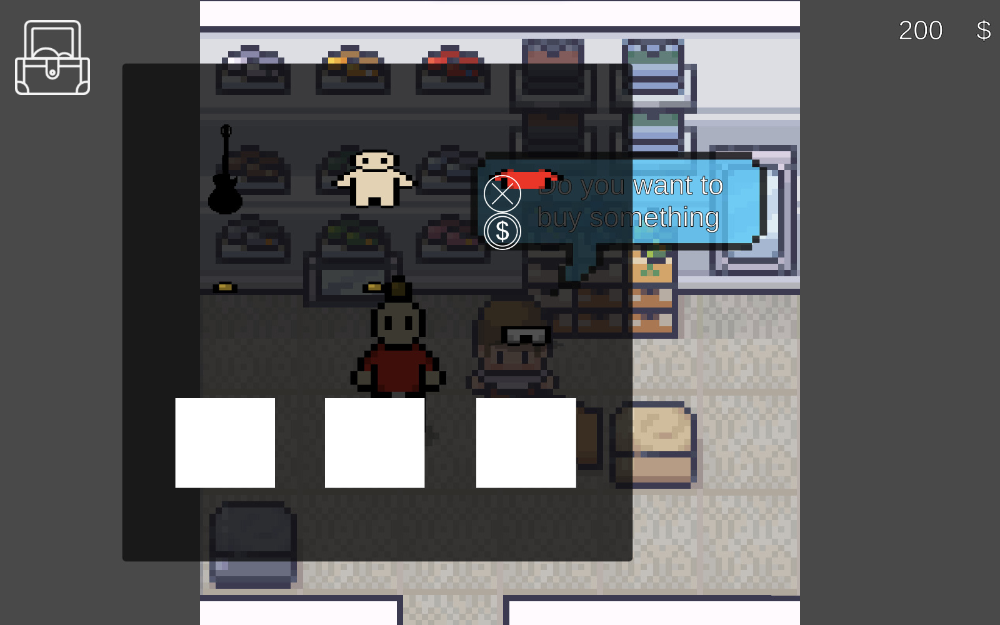
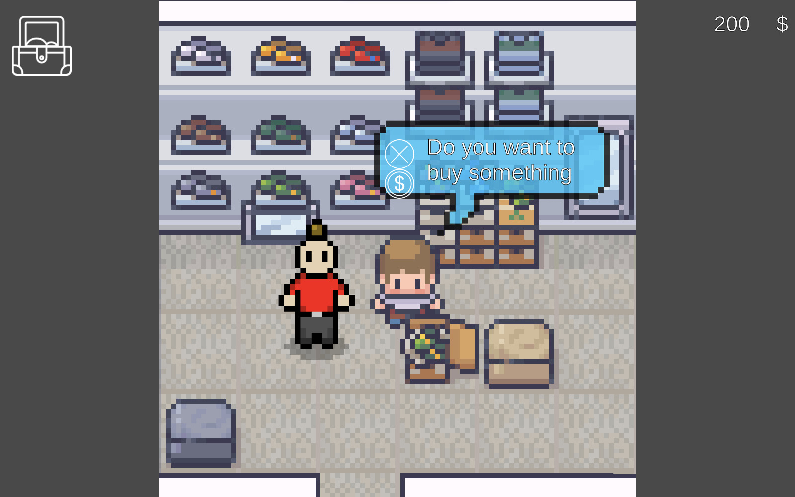
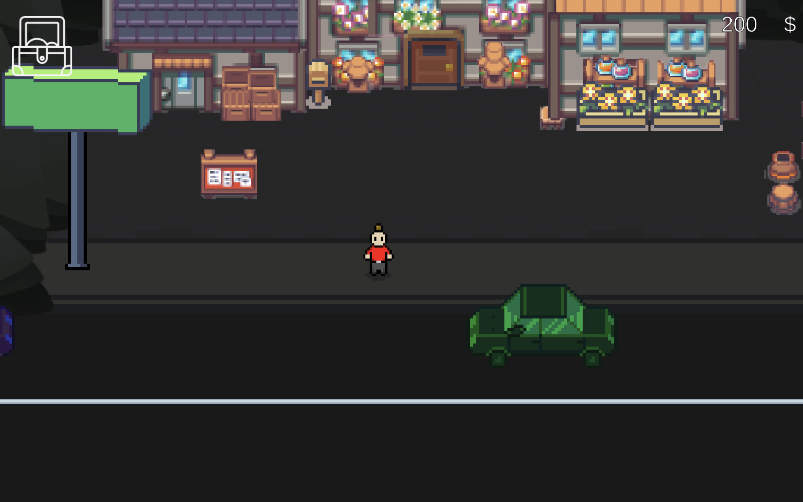
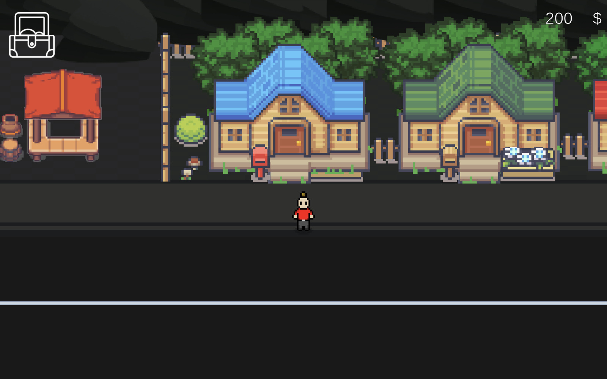
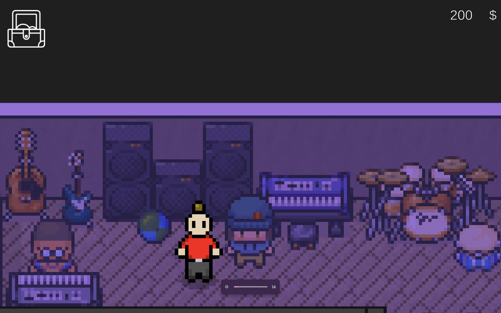
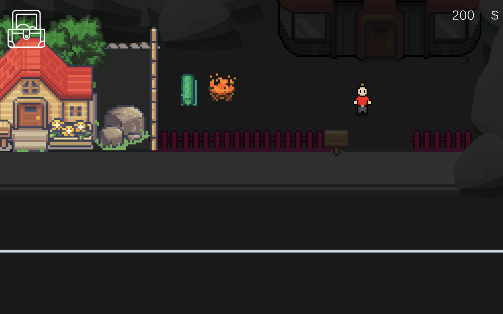
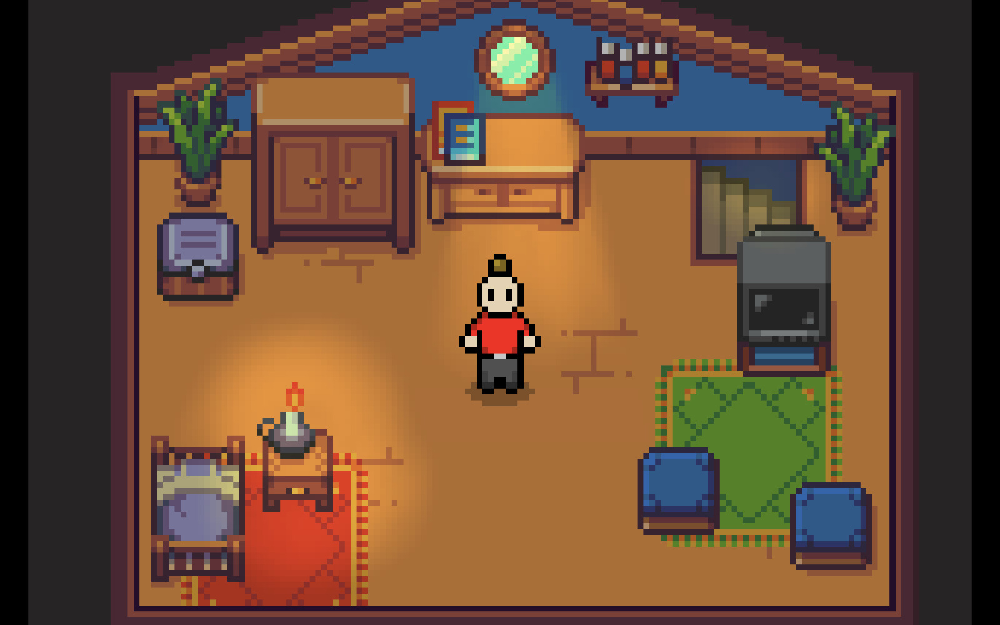

The system is a collection of scripts that work together to create a small game with multiple scenes and functionalities such as inventory management, NPC interaction, and scene transitions. The scripts are written in C# and use UnityEngine, a game engine developed by Unity Technologies.

- **SO_CharacterBody**: Creates a ScriptableObject to manage character body parts with a name and reference to specific body part ScriptableObjects.
- **BuySellManager**: Manages buying and selling in the market scene, tracks player money and inventory using a LinkedList, and performs actions based on indexes.
- **CameraFollow**: Controls camera movement, following the player horizontally with an offset to maintain a specific view range.
- **CarManager**: Handles car spawning, movement, and destruction, using a LinkedList to store instantiated cars and sorting based on player position.
- **DiscoMaker**: Creates a "disco" effect by changing the color of a sprite renderer using InvokeRepeating and Random.value.
- **InventoryToggle**: Controls the opening and closing of the inventory menu, detecting player input and adjusting the inventory menu's active state.
- **MarketSpeech**: Manages player-NPC interaction in the market scene, activating speech bubbles and buttons based on collisions and controlling market inventory and trading modes.

# Guitar-Life

